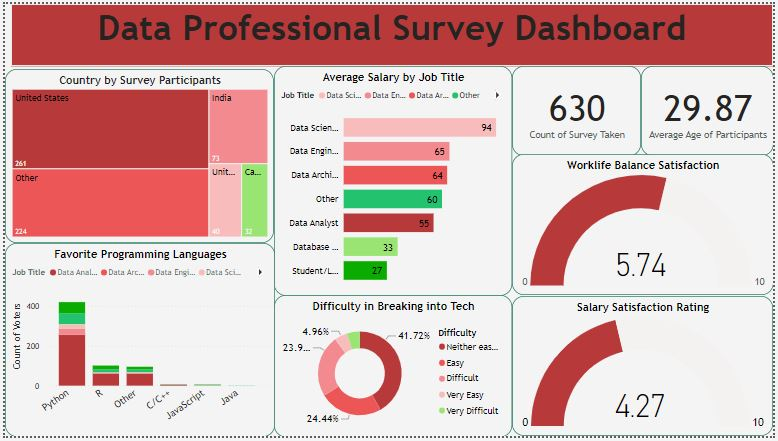

## **Data Career Professional Survey**

## **Project Objectives**
The objective of this project is to create a comprehensive Power BI dashboard utilizing the data collected from the data professional survey. The dashboard aims to provide meaningful insights and visualizations regarding various aspects of the data professionals' roles, career paths, job satisfaction, salary ranges, demographics, and more. By leveraging Power BI's interactive features and visual capabilities, the objective is to present the survey data in an intuitive and impactful manner, enabling users to explore and understand the key findings and trends within the data professional community.

## **Project Files**
Image: This contains all the images used in this project

PowerBI Report: This provides all the visualizations and reports on the project.

Raw file.xlsx: This is the dataset for the project.

## **Problem Statement**

1. What is the distibution of survey participants by their countries?
2. What is the count of the favorite programming language of participants?
3. What is the average salary by job title of the professional participants?
4. What is the level of difficulty of breaking into tech (by percentage)?
5. On a scale of 10 (1 as poor and 10 as excellent), what is the worklife balance satisfaction of the participants?
6. On a scale of 10 (1 as poor and 10 as excellent), what is the salary satisfaction rating of the participants?
7. What is the count of participants in the survey?
8. What is the average age of the professional participants?

## **Steps Taken to Provide Answers to the above Questions**

1. **Data Preparation**: Import the Excel source file, clean and format the data for analysis in Power BI.
2. **Data Modeling**: Design relationships, hierarchies, and measures to create an optimized data model in Power BI.
3. **Visual Design**: Select and customize appropriate visualizations to effectively represent the data and convey insights.
4. **Interactivity and Filters**: Implement slicers, filters, and drill-down features to enable dynamic data exploration and analysis.
5. **Dashboard Publishing and Sharing**: Publish the interactive Power BI dashboard to the desired platform and configure sharing settings for collaboration and access control.

## **PowerBI Report**
Here is the PowerBI report that i built using Microsoft PowerBI to further visualize the insights and trends derived from the analysis.

## **Dashboard**

## **Key Findings**

Based on the provided questions from the survey data, here are five key findings:

1. Country Distribution: The survey participants are distributed across various countries, with the highest number of participants from United States of America, followed by India and others.
2. Programming Language Preference: The count analysis reveals that Python is the most favored programming language among the participants, followed by R and others.
3. Salary Variation by Job Title: The average salary varies significantly based on job titles among the professional participants, with Data Scientist having the highest average salary, followed by Data Engineer and Data Architect.
4. Difficulty Breaking into Tech: The survey indicates that a 41.72% of participants found breaking into the tech industry to be neither easy not difficult, followed by 24.44% that said it is easy and another 23.9% that said it is difficult.
5. Work-Life Balance Satisfaction: Participants, on average, rated their work-life balance satisfaction as 5.74 out of 10, indicating a moderate level of satisfaction with balancing work and personal life commitments.
6. Salary Satisfaction Rating: The average salary satisfaction rating is 4.27 out of 10, suggesting a relatively lower level of satisfaction with regards to salary.

